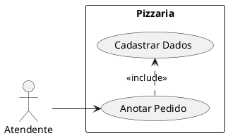
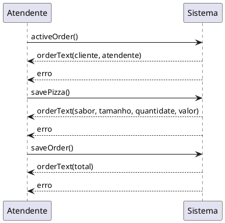
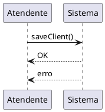

# Projeto Final APS

## Documentação

### Diagrama de caso de uso



#### Anotar pedido

**Descrição:** Atendente anota pedido do cliente.

**Atores:** Atendente.

**Pré-condições:** Atendente seleciona seu nome.

**Fluxo básico:**

1. Inicia pedido, caso o cliente tenha um cadastro.

1. Adiciona as pizzas desejadas pelo cliente.

1. Finaliza o pedido do cliente.

**Fluxo alternativo:**

1. Cliente não é cadastrado.

1. Cadastrar cliente.

#### Cadastrar dados

**Descrição:** Atendente anota pedido do cliente.

**Atores:** Atendente.

**Pré-condições:** Cliente não está cadastrado.

**Fluxo básico:**

1. Inicia o cadastro do cliente, pedindo.

1. Adiciona as pizzas desejadas pelo cliente.

1. Finaliza o pedido do cliente.

**Fluxo alternativo:**

1. Cliente não é cadastrado.

1. Cadastrar cliente.

### Diagrama de sequência





### Diagrama de classe


## Instruções

Crie um *virtual environment*.

```
python3 -m venv env
```

Instale as bibliotecas.

```
env/bin/pip install -r requirements.txt
```

Execute o programa.

```
env/bin/python3 main.py
```

## Captura de tela


