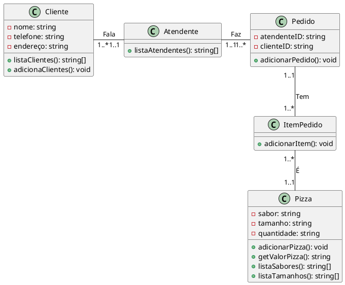

# Projeto Final APS

## Documentação

### Diagrama de caso de uso


### Diagrama de sequência


### Diagrama de classe



## Instruções

Crie um *virtual environment*.

```
python3 -m venv env
```

Instale as bibliotecas.

```
env/bin/pip install -r requirements.txt
```

Execute o programa.

```
env/bin/python3 main.py
```
